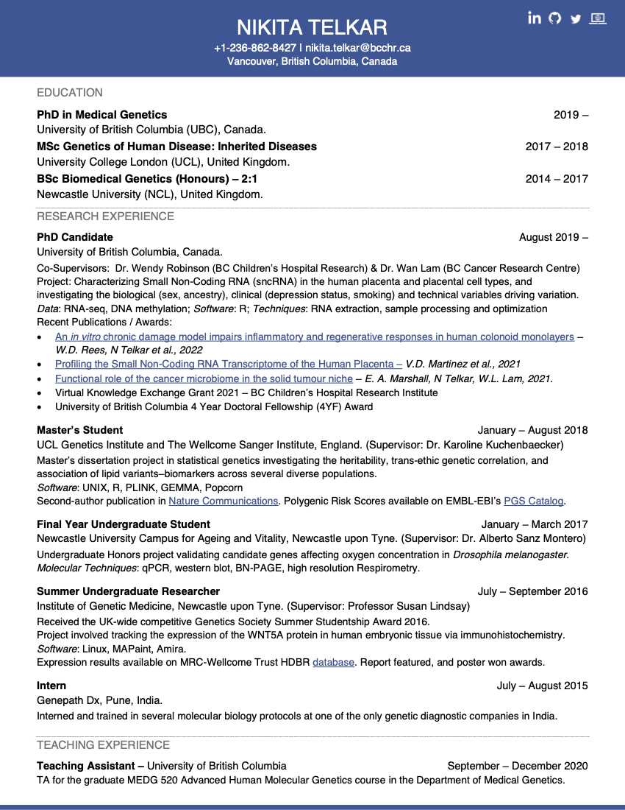
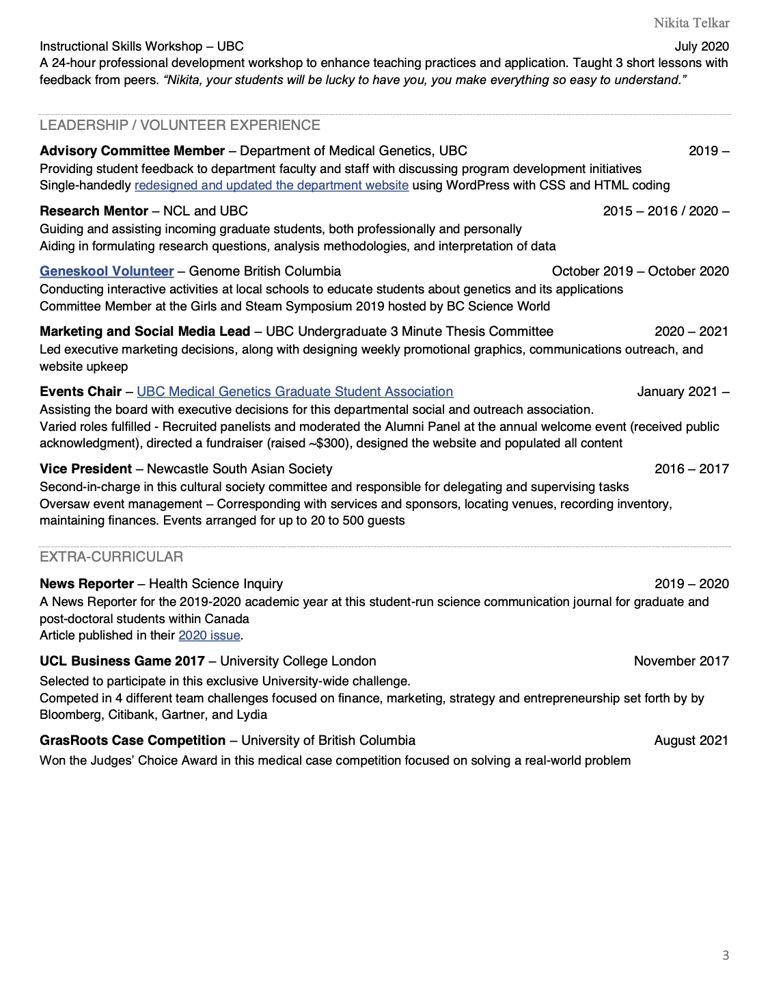

---
title: "Academic CV"
output: 
  html_document: 
    theme: flatly
    highlight: monochrome
    keep_md: yes 
    # toc: true  
    # toc_depth: 6
    # toc_float: 
    #   collapsed: true 
    #   smooth_scroll: true
--- 

***  

